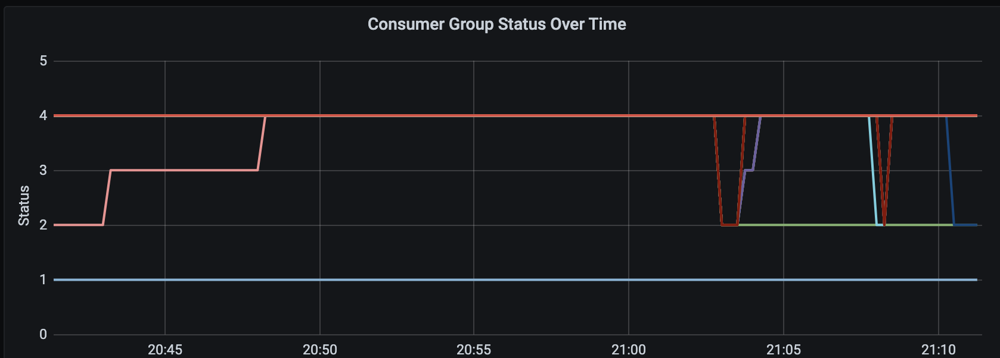
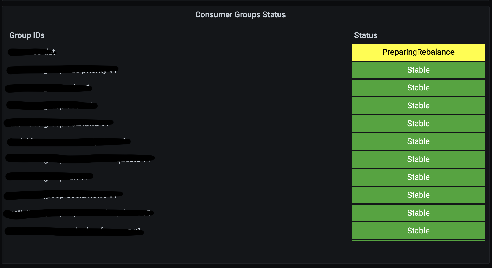

# kafka_consumer_group_status_exporter
Kafka Consumer Group status exporter for Prometheus.

Can be used to track the current consumer group status & rebalances of your consumer groups over time. Examples:




## Compatibility

Java 1.8 is required to run the exporter.

Supports [Apache Kafka](https://kafka.apache.org/) 2.1 or later.

## Compiling

This uses Maven, so you would simply compile this by doing this at the root of the project: `mvn clean package`

## Running

```
java -jar kafka_consumer_group_status_exporter-0.3.0-jar-with-dependencies.jar --bootstrap-servers=<kafka-hostname>:9092 --port <port>
```

You can also run this to print out the help usage:

```
java -jar kafka_consumer_group_status_exporter-0.3.0-jar-with-dependencies.jar --help
```

## TODO

* Set up CI for future PR's.

## Contributing

1. See [CONTRIBUTING.md](./CONTRIBUTING.md)
2. Fork it ( https://github.com/[my-github-username]/kafka_consumer_group_status_exporter/fork )
3. Create your feature branch (`git checkout -b my-new-feature`)
4. Commit your changes (`git commit -am 'Add some feature'`)
5. Push to the branch (`git push origin my-new-feature`)
6. Create a new Pull Request

## License

kafka_consumer_group_status_exporter is licensed under an Apache 2 license. Contributors are required to sign an contributor license agreement. See LICENSE.txt and CONTRIBUTING.md for more information.
